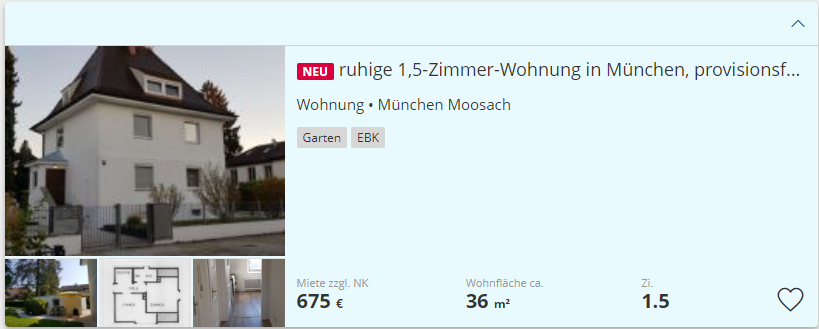

# Rent Predictor

The rent predictor is a web app that uses machine learning to predict rents in Germany.

## Data
The training data consists of ~49'000 apartment ads, which were scraped from the German real estate platform immonet.de.
