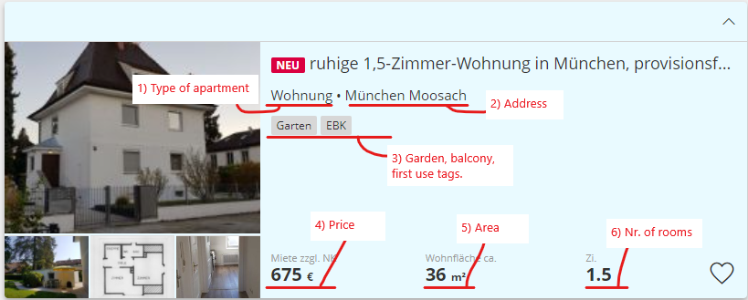
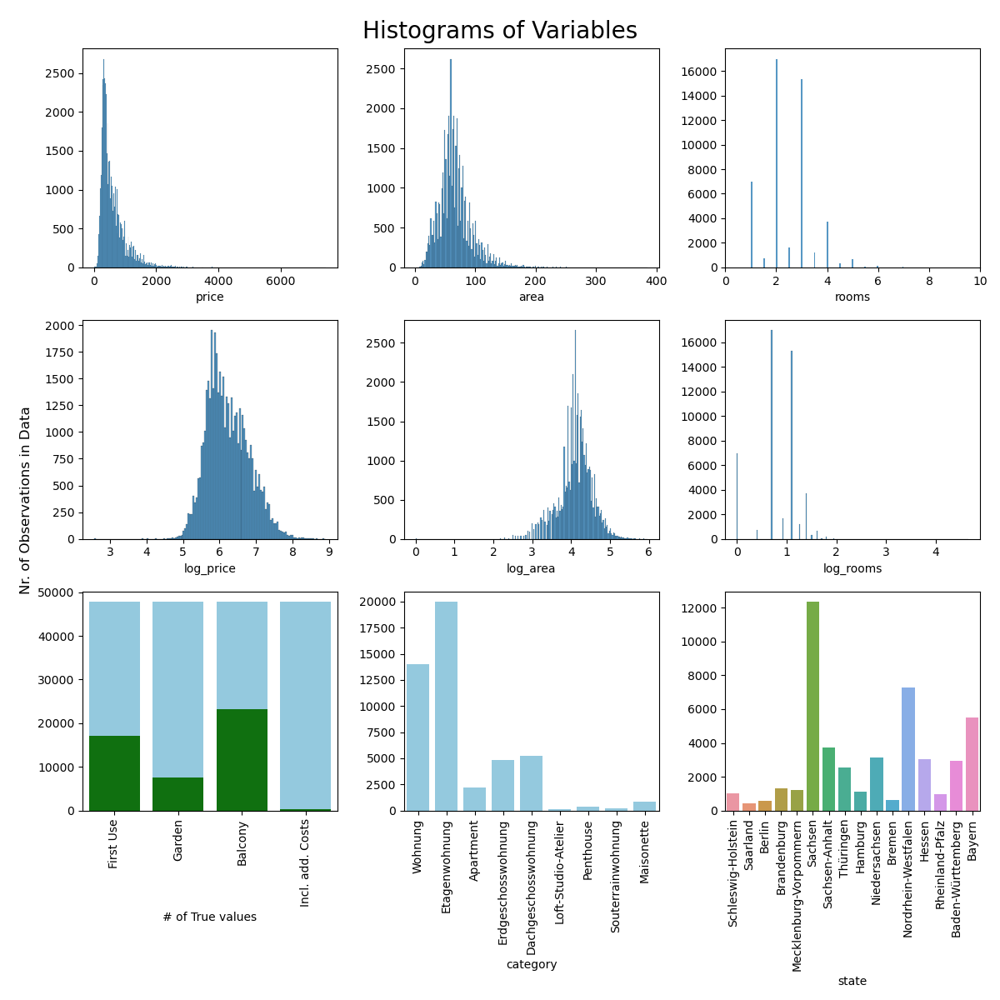

# Rent Predictor

The Rent Predictor is a web app that uses machine learning to predict rents in Germany.

## Data Collection
The training data consists of ~49'000 apartment ads, which were scraped from the German real estate platform immonet.de.

Each ad contains information about the aparment's:

1) Type
2) Approximate address
3) Availability of a garden, balcony, and existance of previous tenants (first use)
4) Price in € (inclusive or exclusive additional costs)
5) Are in m²
6) Nr of rooms

## Exploratory Data Analysis
### 1) Distribution of price and features:

### 2) Spacial distribution of apartments:

Addresses were converted to longitude and latitude values using the google maps API, resulting in the following distribution.

### 3) Coropleth map of price per county:
Using a shapefile of all german counties, regional price differences can be illustrated graphically.

